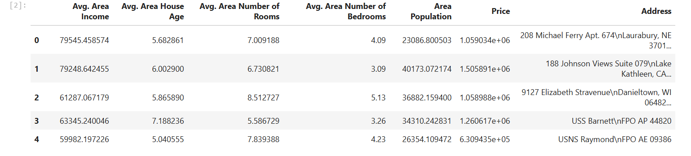
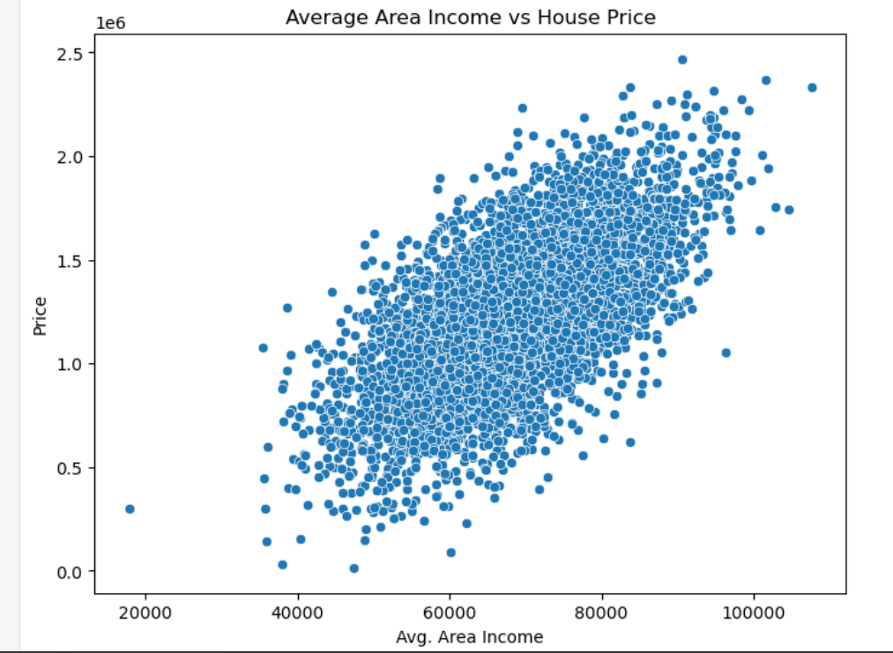
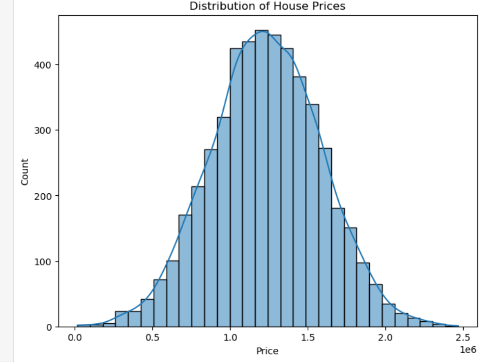
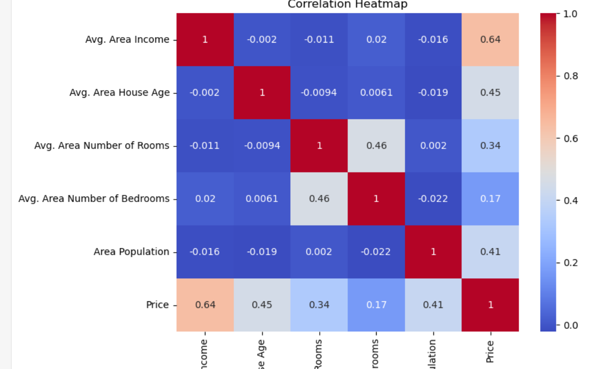
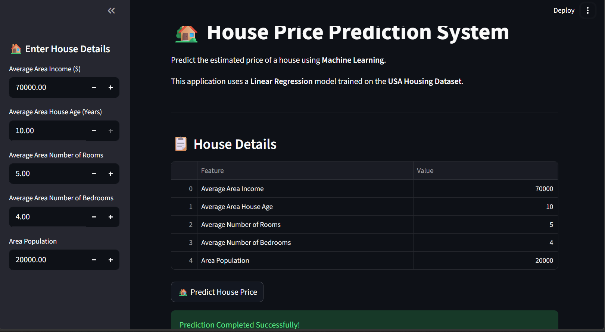

# 🏡 House Price Prediction using Machine Learning

## 🏢 Internship Project

This project was completed as part of the **QSkill Artificial Intelligence & Machine Learning Internship Program (June–July 2026)**.

The objective of this project is to predict house prices using **Machine Learning** based on various housing features. The project demonstrates the complete machine learning workflow, including data preprocessing, visualization, model training, evaluation, and deployment with Streamlit.

---

## 📌 Project Overview

House price prediction is a regression problem where the goal is to estimate the price of a house based on its characteristics.

In this project, a **Linear Regression** model is trained using the **USA Housing Dataset** to predict house prices from numerical features.

---

## 🎯 Objectives

- Analyze the housing dataset
- Visualize important features
- Train a Linear Regression model
- Evaluate model performance
- Predict house prices
- Build an interactive Streamlit web application

---

## 📂 Dataset

**Dataset:** USA Housing Dataset

### Features

- Average Area Income
- Average Area House Age
- Average Area Number of Rooms
- Average Area Number of Bedrooms
- Area Population

### Target

- Price

### Note

The **Address** column is excluded because it contains text values and is not used by the Linear Regression model.

---

## 🛠 Technologies Used

- Python
- Pandas
- NumPy
- Matplotlib
- Seaborn
- Scikit-learn
- Joblib
- Streamlit
- Jupyter Notebook

---

## 📊 Exploratory Data Analysis (EDA)

The dataset was analyzed using:

- Dataset Information
- Statistical Summary
- Missing Value Analysis
- Scatter Plot
- Histogram
- Correlation Heatmap
- Pair Plot

---

## 🤖 Machine Learning Model

**Algorithm Used**

- Linear Regression

### Workflow

1. Load Dataset
2. Data Exploration
3. Data Visualization
4. Feature Selection
5. Train-Test Split
6. Model Training
7. House Price Prediction
8. Model Evaluation

---

## 📈 Model Evaluation

The model was evaluated using:

- Mean Absolute Error (MAE)
- Mean Squared Error (MSE)
- Root Mean Squared Error (RMSE)
- R² Score

---
## 📈 Model Performance

The Linear Regression model was evaluated using standard regression metrics.

| Metric | Value |
|---------|-------|
| Mean Absolute Error (MAE) | 80,879.10 |
| Mean Squared Error (MSE) | 10,089,009,300.89 |
| Root Mean Squared Error (RMSE) | 100,444.06 |
| R² Score | **91.80%** |

### Conclusion

The model achieved an **R² Score of 91.80%**, which indicates that it can explain most of the variation in house prices based on the selected features. This demonstrates that the model provides reliable predictions on the USA Housing dataset.

---

## 🌐 Streamlit Web Application

The application allows users to:

- Enter housing details
- Predict house prices instantly
- View the entered data
- Get an estimated house price

---

## 📁 Project Structure

```
House-Price-Prediction/
│
├── USA_Housing.csv
├── house_price_prediction.ipynb
├── app.py
├── house_model.pkl
├── requirements.txt
├── README.md
└── screenshots/
    ├── dataset.png
    ├── scatterplot.png
    ├── histogram.png
    ├── heatmap.png
    ├── pairplot.png
    ├── prediction.png
```

---

## 🚀 Installation

Clone the repository

```bash
git clone https://github.com/bindu-ai-dev/USA_House-Prediction.git
```

Go to the project folder

```bash
cd USA_House-Prediction
```

Install dependencies

```bash
pip install -r requirements.txt
```

Run the Streamlit application

```bash
streamlit run app.py
```

---

## 📸 Project Screenshots

### Dataset Preview



### Scatter Plot



### Histogram



### Correlation Heatmap



### Streamlit Prediction



---

## 💡 Future Improvements

- Support additional regression algorithms
- Include location-based features
- Add model comparison
- Deploy the application online
- Improve prediction accuracy using advanced models

---

## 📚 Skills Demonstrated

- Data Analysis
- Data Visualization
- Regression Modeling
- Machine Learning
- Model Evaluation
- Streamlit Deployment
- GitHub Project Management

---

## 👩‍💻 Author

**Bindu**

Artificial Intelligence & Machine Learning Intern

Passionate about Artificial Intelligence, Machine Learning, Data Science, and Generative AI.

---

